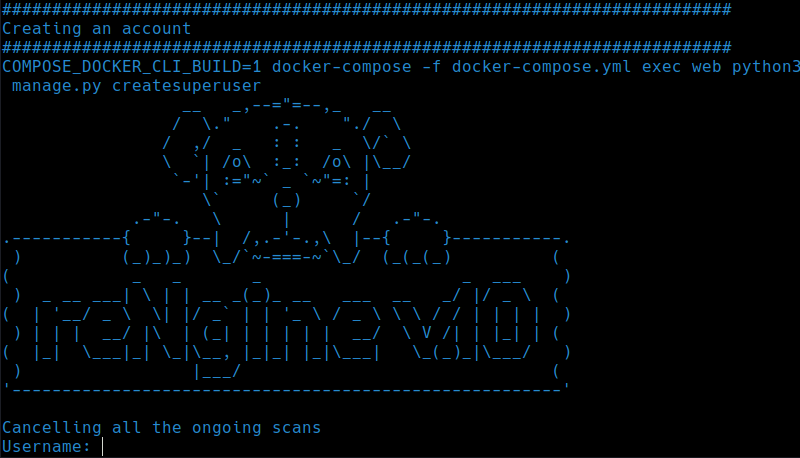

# Installing reconPoint on Linux/Windows/Mac

This document aims to provide detailed instructions on setting up and running the **reconPoint**.


!!! info "Attention"
    If you wish to run reconPoint on any debian Linux (like Ubuntu), there is a installation script that will ease your docker installation and does required setup for you. Consider using it. [Quick Installation](#quick-installation) You can skip prerequisites **if you are running Ubuntu**

This document is further divided into 3 parts:

1. [Prerequisites](#prerequisites)

2. [reconPoint Installation](#reconpoint-installation)


## Prerequisites

**reconPoint** uses several scripts and tools, those tools or scripts rely on various tools to be installed like Go, Python, etc, and to avoid any dependency issues, we decided to use Docker. Using Docker will not only ease the dependency issues but will also ease the installation steps. As a penetration tester, you need not focus on solving the dependencies, installing required tools, etc. With few installation steps, you should be good to run **reconPoint**.

**reconPoint** requires `docker`, `docker-compose` and `make` to be installed before you begin installing reconpoint.

### Docker
Docker provides very good documentation on how to install docker based on your Operating System. You can [follow the documentation here.](https://docs.docker.com/get-docker/)

#### Docker installation on Ubuntu/Linux Distributions

!!! warning
    The installation steps have been directly taken from [Docker Guide](https://docs.docker.com/engine/install/ubuntu/) with no modification.

* Update the `apt` package index and install the below packages

```
sudo apt-get update
```

```
sudo apt-get install \
    apt-transport-https \
    ca-certificates \
    curl \
    gnupg-agent \
    software-properties-common
```

* Add Docker official GPG key

```
curl -fsSL https://download.docker.com/linux/ubuntu/gpg | sudo apt-key add -
```

* Use the following commands to setup the stable repository

```
sudo add-apt-repository \
   "deb [arch=amd64] https://download.docker.com/linux/ubuntu \
   $(lsb_release -cs) \
   stable"
```

* Finally install Docker Engine

```
sudo apt-get update && sudo apt-get install docker-ce docker-ce-cli containerd.io
```

* Test the Docker by running `docker` command on your console/terminal.

#### Docker installation on Windows

Docker requires [Docker Desktop](https://docs.docker.com/docker-for-windows/install/) to be installed on your Windows OS. Installing Docker Desktop is as easy as double clicking the `InstallDocker.msi` installer, [downloaded from here](https://hub.docker.com/editions/community/docker-ce-desktop-windows/).

#### Docker installation on Mac OS

Docker requires [Docker Desktop](https://docs.docker.com/docker-for-mac/install/) to be installed on your Mac OS. Follow the instruction from Docker hub to [install Docker on Mac OS](https://hub.docker.com/editions/community/docker-ce-desktop-mac/).

#### Docker installation on Windows WSL

Nick Janetakis has a well written blog and a Video guide on [how to install Docker on Windows Subsystem Linux](https://nickjanetakis.com/blog/a-linux-dev-environment-on-windows-with-wsl-2-docker-desktop-and-more). Please follow the video/blog guide on how to install Docker on WSL.

### Docker Compose

If you're running **Docker Desktop** you can skip installing `docker-compose` as `docker-compose` comes along with Docker Desktop. This applies for both Windows and Mac OS users.

If you're using Linux distributions or WSL, you will still need to install `docker-compose` and the [installation steps](https://docs.docker.com/compose/install) are similar.

#### Installing `docker-compose` on Linux systems

* Download the latest stable version of `docker-compose`

```
sudo curl -L "https://github.com/docker/compose/releases/download/1.29.2/docker-compose-$(uname -s)-$(uname -m)" -o /usr/local/bin/docker-compose
```

* Apply executable permission

```
sudo chmod +x /usr/local/bin/docker-compose
```

* Create a symbolic link

```
sudo ln -s /usr/local/bin/docker-compose /usr/bin/docker-compose
```

* Verify your installation by running

```
docker-compose --version
```

!!! info
    If `curl` is not working, there are [alternate installation steps](https://docs.docker.com/compose/install/#alternative-install-options) as well. You can use `pip` or install as a container. Follow the [alternate installation steps](https://docs.docker.com/compose/install/#alternative-install-options).

### make

#### make installation on Linux Distributions

Install the latest version of make using

```
sudo apt install make
```

Although it is optional, `build-essential` package can also be installed which contains `make` utility.

```
sudo apt install build-essential
```

All prerequisites are now satisfied.


**Let's begin by cloning reconPoint**.

## Installation

### Clone reconPoint
```
git clone https://github.com/khulnasoft/reconpoint && cd reconpoint
```

### dotenv file

Edit the dotenv file using `nano .env` or `vi .env` or `vim .env`.


The sample [.env](https://github.com/khulnasoft/reconpoint/blob/master/.env) file can be found [here](https://github.com/khulnasoft/reconpoint/blob/master/.env).

```
#
# General
#
COMPOSE_PROJECT_NAME=reconpoint

#
# SSL specific configuration
#
AUTHORITY_NAME=reconPoint
AUTHORITY_PASSWORD=nSrmNkwT
COMPANY=reconPoint
DOMAIN_NAME=recon.example.com
COUNTRY_CODE=US
STATE=Georgia
CITY=Atlanta

#
# Database configurations
#
POSTGRES_DB=reconpoint
POSTGRES_USER=reconpoint
POSTGRES_PASSWORD=hE2a5@K&9nEY1fzgA6X
POSTGRES_PORT=5432
POSTGRES_HOST=db

#
# Celery CONCURRENCY Autoscaling
# The number of CONCURRENCY defines how many scans will run in parallel
# Please always keep minimum of 5
#
MIN_CONCURRENCY=5
MAX_CONCURRENCY=30
```

#### .env Explained

* **COMPOSE_PROJECT_NAME**: This will help reconPoint name docker containers as reconpoint_web_1, reconpoint_celery_1 etc. <small>(Making changes is Optional)</small>

* **AUTHORITY_NAME**: SSL Authority Name
* **AUTHORITY_PASSWORD**: SSL Authority Password
* **COMPANY**: Company Name to generate SSL to
* **DOMAIN_NAME**: Domain where reconPoint is going to be installed
* **COUNTRY_CODE, STATE, CITY**: SSL Speciffc

* **POSTGRES_DB**: DB name for Postgres <small>(Making changes is Optional)</small>
* **POSTGRES_USER**: Postgres Username for DB auth purpose <small>(Making changes is Optional)</small>
* **POSTGRES_PASSWORD**: Postgres Password for DB auth purpose <strong>(Please change the default Postgres Password)</strong>
* **POSTGRES_PORT**: Postgres Port <small>(Making changes is Optional)</small>
* **POSTGRES_HOST**: Postgres HOST <small>(Making changes is Optional)</small>

* **MIN_CONCURRENCY**: Minimum number of Concurrency for Celery.
* **MAX_CONCURRENCY**: Maximum number of Concurrency for Celery. This determines how many maximum number of scans to run in parallel.

#### Determining CONCURRENCY Values

Here is the ideal value for MIN_CONCURRENCY and MAX_CONCURRENCY depending on the number of RAM your machine has:

* <strong>4GB</strong>: `MAX_CONCURRENCY=10`
* <strong>8GB</strong>: `MAX_CONCURRENCY=30`
* <strong>16GB</strong>: `MAX_CONCURRENCY=50`

This is just an ideal value which developers have tested and tried out and works! But feel free to play around with the values.

Maximum number of scans is determined by various factors, your network bandwith, RAM, number of CPUs available. etc

### Generating SSL Certificates

reconPoint runs on https unless otherwise used for development purpose. Using https is recommended. To generate the certificates you can use

```
sudo make certs
```

!!! danger ""
    Please note, while running any `make` command, you must be inside the reconpoint/ directory.

### Build reconPoint

To build the reconPoint, use the following command

```
sudo make build
```

The build process is a lengthy process and expected to take some time.

!!! info ""
    Thanks to [Baptiste MOINE](https://github.com/Creased) for sending the PR that made build process so much simpler.

### Run reconPoint

Once the build process is successful, we're good to run reconPoint. This can be done using below command

```
sudo make up
```

**reconPoint can now be accessed from https://127.0.0.1 or if you're on the VPS https://your_vps_ip_address**

### Registering an account

You will need to create a username and password in order to login to the reconPoint. To register reconPoint, please run the following command

```
sudo make username
```

You will now be prompted with some personal details(optional), username and password. **We highly recommend that you set a strong password for reconPoint.**



You may now login to the reconPoint web portal using the username and password that you just provided.

### Checking logs

If you need to observe the logs, it can be done so by running the commmand

```
sudo make logs
```

!!! note
    If you encounter any issues while setup or scan, we advice you to [raise an issue in Github](https://github.com/khulnasoft/reconpoint/issues) and attach the log. While raising any new issues on Github, it is also adviced that you to look for any open issues on Github as well.

### Stopping reconPoint

If you wish to stop the reconPoint, it can be done so by using the command

```
sudo make stop
```

### Restarting reconPoint

reconPoint can be restarted using the command

```
sudo make restart
```

### Removing all reconPoint Data

If you wish to delete all your recon data, it can be done using

!!! danger
    This is a irreversible process and once pruned, you may never get back your recon data.
    Use with caution.

```
sudo make prune
```
